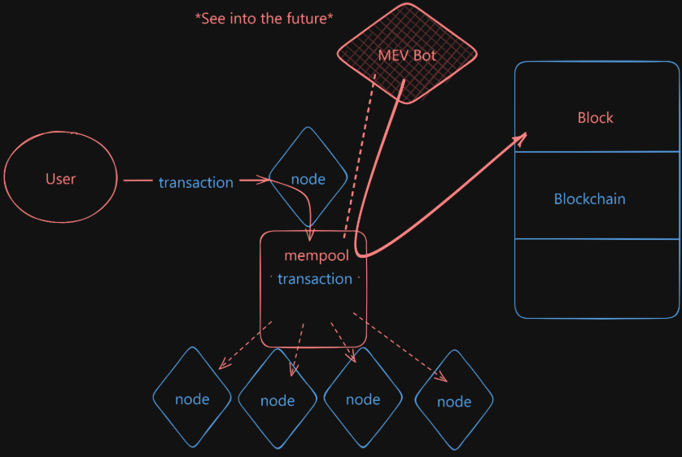
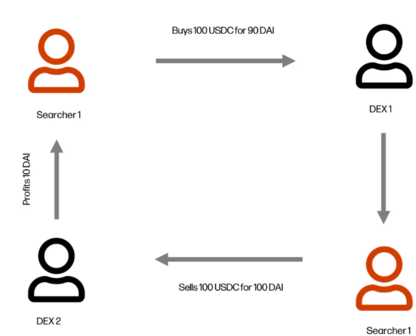
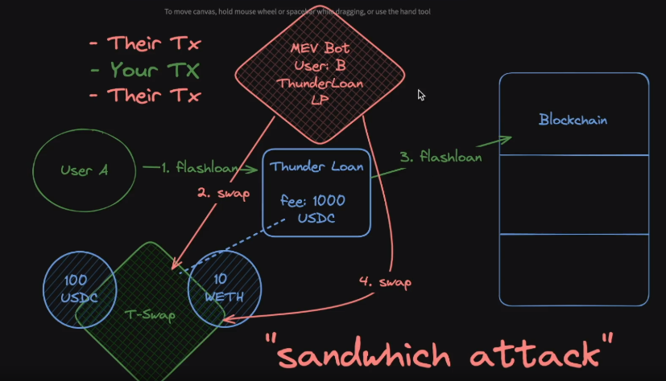
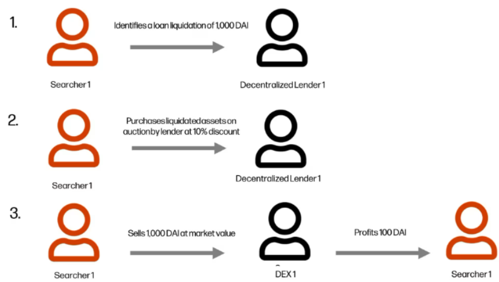
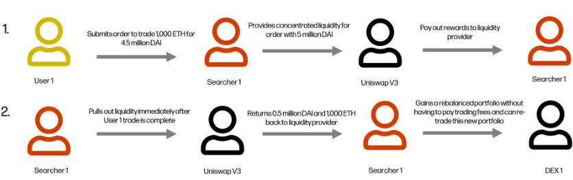
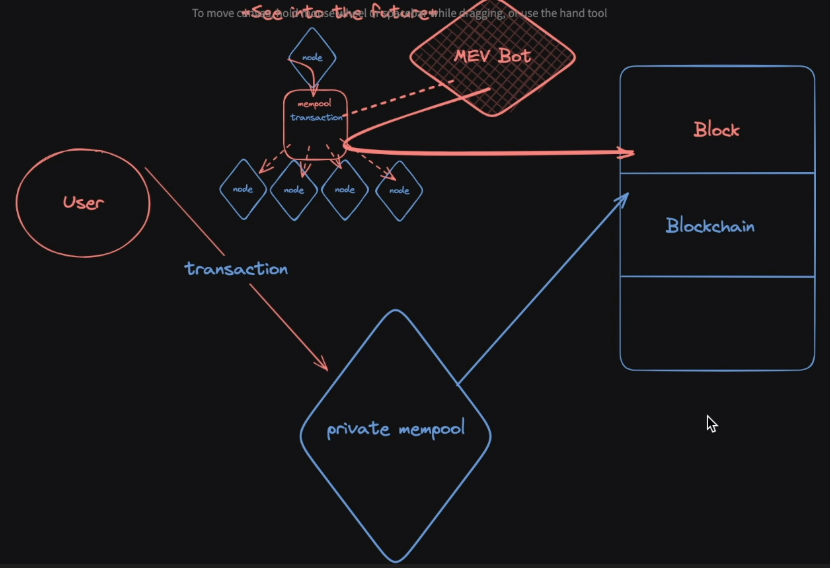
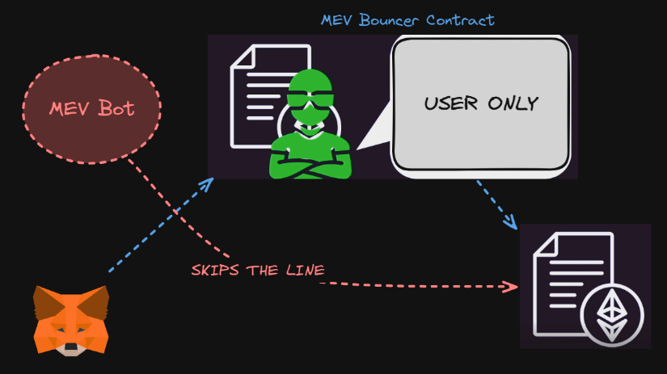

+++
title = 'MEV (Maximum Extractable Value)'
date = 2025-04-23T18:13:31+05:30
draft = false
sharingLinks = ["twitter", "email", "whatsapp"]
+++

## What's MEV?
- ***It's the value that blockchain node operators and users can extract by ordering transactions in a block in a specific order.***

- *When a transaction is initiated, it is directed to a specific node which, instead of immediately integrating it into its block, places it into its 'memory pool', or <u>'mempool'</u> {waiting area for transactions}. This constitutes the lower tier of workings that enable blockchain.*




- Suppose you're a malicious user and want to use this to your advantage. You have the ability to scan the mempool, essentially predicting future transactions.

---
## Example 
Let's say `User A` is malicious, and sees someone make a transaction that is going to make them $100.  

Well `User A` might just say "Hey! I want to make $100!" 

So what `User A` can do is something called <u>*__front-running__*</u>. They can send their own transaction ahead of your transaction to extract some value. The only reason they are able to extract this value is because they were able to see your transaction ahead of time.  
- Front-running is one of the most common forms of MEV. 

---
## Types 

### Arbitrage

- We have a price on Uniswap for BTC/USDT , so selling BTC for USDT. we can have the same pool , the same price BTC to dollar with the BTC to USDT pool.

- Lets say , `User A` buys 10 BTC from the first pool, now the price will increase. this means we will have different prices for BTC to USDT.

- Here, MEV bot an arbitrager comes in and rebalances the pool, he will do some swap or use flashloan,  and the prices will become roughly the same.



### Sandwich Attacks

Where the attacker front-runs the user and then back-runs the user where basically they see the transaction by the user and then they step in. (in this order)
1. Attacker Txn (front-run)
2. User Txn
3. Attacker Txn (back-run)

ThunderLoan MEV example : 
1. `User A` makes a request to the Thunderloan protocol for a flash loan.
2. Seeing the incoming flash loan request, `User B`, decides to exploit the situation. `User B` doesn't just want the fee to be high, they want it way higher!
3. `User B` then front runs the flash loan function, and spikes the price on Uniswap by taking out a flash loan _themselves_ to make the price go higher. Effectively, this swap alters the balances from the initial ten USDC and one ETH to highly skewed figures: perhaps 0.1 ETH and an astronomical amount of USDC (let's say a billion). Since the fee is derived from the T-Swap pool, the Thunder Loan platform now has a way bigger fee, that the user wasn't aware of.
4. Then, after collecting the fee, User B swaps back to the original ratio of 10 USDC and 1 ETH.





### Liquidations 





### JIT (Just in time liquidity)

- This is an attack, its part of Uniswap V3 where in V3 we have fragmented liquidity, so you have price ticks or price buckets.

- Let's say Tether price is $2000, when the price shoots up and somebody does a swap. this liquidity that you provided at this exact price will be used up, but somebody with an MEV bot with an off-chain monitoring system can actually see that somebody is about to do a swap.

- The MEV bot can front-run this transaction and provide liquidity for this exact price point , this will make it so that their liquidity will be used before yours. but the fees  that the LPs will split between MEV and you.




---

## MEV Prevention

### Using Protection 

- Initializing a bool state variable value as `False` and set it to `True` in an ending transaction function, Then if the state variable value is `True` inside the main function, revert().

### Consider Private Mempool 

- Instead of submitting your transaction to a public mempool, you can send your transaction to this private mempool. Unlike the public mempool, this keeps the transaction for itself until it's time to post it on the chain & uses flashbots.  
- Despite its pros, the private mempool requires you to trust that it will maintain your privacy and avoid front-running. Another downside is the slower transaction speed.  





### Constructing an MEV bouncer contract
-  To save user from getting MEV'ed? (Not Applicable but still)

- But this wont work because the MEV bot (inside the mempool) can see in the bytecode when a contract calls another contract , so the bot just skips the line & call the other contract directly.




```javascript
// SPDX-License-Identifier: MIT
pragma solidity 0.8.20;

interface IFrontRan {
    function withdraw(string memory password) external;
}

contract Bouncer {
    error Bouncer__NotOwner();
    error Bouncer__DidntMoney();

    address s_owner;
    address s_frontRan;

    constructor(address frontRan) payable {
        s_owner = msg.sender;
        s_frontRan = frontRan;
    }

    function go(string memory password) external {
        if (msg.sender != s_owner) {
            revert Bouncer__NotOwner();
        }
        IFrontRan(s_frontRan).withdraw(password);
        (bool success,) = payable(s_owner).call{value: address(this).balance}("");
        if (!success) {
            revert Bouncer__DidntMoney();
        }
    }

    receive() external payable {}
}
```


