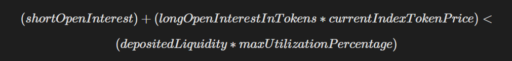
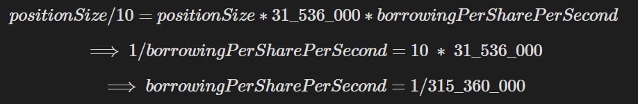
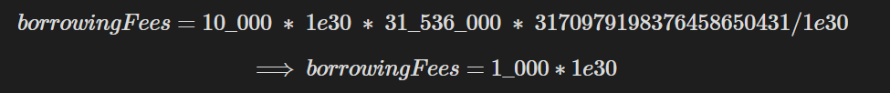

+++
title = 'Perpetuals'
date = 2025-04-17T18:13:31+05:30
draft = false
sharingLinks = ["twitter", "email", "whatsapp"]
+++

## Perpetuals Mission #1

- Perpetuals are essentially just a way for a trader to bet on the price of a certain *index token* without actually buying the token while enabling the trader to employ leverage.
#### Why perpetuals?
Perpetual are named as such because a trader can keep their "perpetual" position open for as long as they'd like, or in perpetuity.

#### So What's a position?
The entire protocol revolves around •positions" that belong to traders, a position is made up of the following:
- Size - This is how much “virtual”  capital a trader is commanding. the size of a BTC perpetual position might be 1.5 BTC. If the price of BTC goes up, the trader is able to realize the profits earned on the 1.5 BTC in their position.
- Collateral - An amount of assets used to "back" a trader's position, when trader's lose money, their losses come out Of the collateral. If the amount of collateral is deemed insufficient for the size of a position, the position is liquidated or force closed.
The `size / collateral` is the leverage of a position. E.g. if I open a position with $10,000 of USDC as collateral and a size of $20,000 of BTC, my leverage is 2x.

#### Long/Short
There are 2 different directions a perpetual position can take. <!--[[long-short-explained.png]]-->
- **Long** → The trader profits when the price of the `index token goes up`, and loses when the price of the index token goes down.
- **Short**  → The trader profits when the price of the `index token goes down`, and loses when the price of the index token goes up.
#### Traders
- Traders are the actors opening perpetual positions and betting on the price of the index token.
- Traders profit when the price of the index token moves in the direction they predict, and lose when it moves in the direction opposite to what they predict.
- Traders must provide collateral for their position, the collateral is used to cover their losses in the event that price moves in the opposite direction of what they predicted.
#### Liquidity Providers
- Liquidity providers take the opposite side of Traders. they stand to profit when traders lose money or are liquidated. LPs also often collect fees from the trader, such as opening and closing fees, or borrowing fees.
- Liquidity providers provide the assets that are used to pay out profit for traders. When a trader profits they get tokens from the LP. When a trader loses, they pay tokens to the liquidity providers out of their position's collateral.

#### Open Interest
- Open interest is the measure of the aggregate size of all positions. <!--[[open_positions_explained.png]]-->
	- Trader A $50,000 Long , Trader B $25,000 Long = $75,000
	- Trader C $60,000 Short = $60,000            → tot is $135,000 net
	- net amt just measures what is the net aggregate amt that has been loaned out by LPs (what amount has been borrowed in general).

#### Liquidity Reserves

Liquidity reserves are necessary such that at all times there are enough assets in the liquidity pool (provided by liquidity providers) to pay out the profits for positions.

If there is only 10 USDC of liquidity deposit                         ed by liquidity providers, then allowing a trader to open a perpetual contract with $10,000 of size would be irresponsible. If the price moves even a little bit in the trader’s direction they will be more than $10 in profit, yet there will not be enough USDC to pay them out.

Liquidity reserve restrictions may be somewhat arbitrary, similarly to the configured liquidation threshold. Here’s a reasonable formula to follow:


To be more accurate, we can account for the differences in longs/shorts.

Shorts can never profit more than the original size of the position, therefore the short OpenInterest is the maximum possible amount paid out to shorts. Longs however can increase in profit without bound, so we can account for the current valuation of total long positions.




Once a liquidity reserve validation such as the ones above have been implemented, trader’s cannot open positions past what is reasonably supported by the deposited liquidity and depositors cannot withdraw liquidity that is crucial for backing existing positions.


---


## Perpetuals Mission #2

#### Decreasing a position
#### **Decrease size**

Similarly to increasing the size of a position, traders have the ability to decrease the size of their position, this includes closing their position (decreasing the size to 0).

However, decreasing a position is slightly more involved, we need to consider the PnL of the trader’s position when we are decreasing it.

If we don’t account for a trader’s PnL and allow them to decrease their size, they could manipulate their PnL and avoid paying losses! Additionally, decreasing the PnL this way reduces the probability that a trader will unexpectedly change the leverage of their remaining position drastically.

So we implement the following calculation when decreasing a position:

```
realizedPnL = totalPositionPnL • sizeDecrease / positionSize
```

The `realizedPnL` is deducted from the position’s collateral if it is a loss, and paid out to the trader in the `collateralToken` if it is a profit.

This way, if a trader decreases their position’s size by 50%, they realize 50% of their PnL.

And if a trader closes their position (e.g. decreases by 100% of the size), they realize 100% of their PnL.

<aside> 💡 If a trader decreases the size of their position to 0, the position should be closed and the remaining collateral (after fees and losses) should be sent back to the trader.

</aside>

Example of decreasing a position’s size with positive PnL (trader is in profit):

- Bob opened his position when the index token price was $100, now the index token price is $110.
- Bob’s position has a size of 100 USD, sizeInTokens of 1, collateral of 50 USDC, and a current PnL of 10 USD — he’s up 10%!
- Bob decides to decrease his position size by 50 USD, e.g. 50% of his position.
- Therefore Bob realizes 50 / 100, 50% of his pending PnL
- `realizedPnl = totalPnl * sizeDecrease / positionSize = 10 * 50 / 100 = 5 USD`
- Bob receives 5 USDC for the 50% of the PnL he realized. This is paid from the LPs.
- Bob’s position now has a size of 50 USD, sizeInTokens of 0.5, collateral of 50 USDC, and a current PnL of 5 USD — he’s still up 10% on his _remaining_ position.

Example of decreasing a position’s size with negative PnL (trader is in loss):

- Bob opened his position when the index token price was $100, now the index token price is $90.
- Bob’s position has a size of 100 USD, sizeInTokens of 1, collateral of 50 USDC, and a current PnL of -10 USD — he’s down 10%!
- Bob decides to decrease his position size by 50 USD, e.g. 50% of his position.
- Therefore Bob realizes 50 / 100, 50% of his pending PnL
- `realizedPnl = totalPnl * sizeDecrease / positionSize = -10 * 50 / 100 = -5 USD`
- Bob pays 5 USDC for the 50% of the PnL he realized. This is paid from his collateral.
- Bob’s position now has a size of 50 USD, sizeInTokens of 0.5, collateral of 45 USDC, and a current PnL of -5 USD — he’s still down 10% on his _remaining_ position.

#### **Decrease collateral**

Just as trader’s are allowed to increase the collateral of their position, they should be allowed to decrease the collateral of their position.

If a trader has a position with 100 USDC as collateral, and chooses to remove 10 USDC from their collateral, they will receive 10 USDC and their position will be updated to have 90 USDC of collateral.

<aside> 💡 Traders may choose to decrease just the size of their position, just the collateral of their position, or both at the same time.

</aside>

#### Liquidation

**What makes a position liquidatable?**

A position becomes liquidatable when it’s collateral is deemed insufficient to support the size of position that is open.

For our implementations we will use a _leverage_ check to define whether a position is liquidatable or not:

```
leverage = size / collateral
```

Leverage is simply the ratio of the position’s size to the position’s collateral. For our protocol we will use an arbitrary `maxLeverage` which can be configured. The `maxLeverage` will be the cutoff point for the maximum leverage a position can have before it is considered liquidatable.

You might use 20x as a value for `maxLeverage` in your tests.

<aside> 💡 Be sure that traders can never modify their position and leave the position’s leverage over the maxLeverage (e.g. the position is liquidatable).

</aside>

**What occurs during liquidation?**

During liquidation, a position is force closed so that the protocol can remain _solvent_.

The following occurs:

- A position is force closed, e.g. size is decreased by 100%.
- Pending unrealized losses from PnL are paid from the position’s collateral.
- Fees such as the `positionFee` for closing 100% of the size are applied, as well as outstanding `borrowingFees`.
- A `liquidatorFee` is taken from the position’s remaining collateral and paid to the `msg.sender` who is invoking the `liquidate` function. It is up to you whether the `liquidatorFee` is a percentage of the remaining collateral or the position’s size, you should have a reasoning for your decision documented in the `README.md`.
- Any remaining collateral for the position is sent back to the user.

<aside> 💡 There are several potential edge cases surrounding liquidation:

- What if the position is being liquidated while in profit?
- What if the position does not have enough collateral to cover it’s losses/fees?
- What if a position is left with insufficient collateral to cover the liquidatorFee?

These are often edge cases that cause bugs and vulnerabilities in any DeFi protocol that involves liquidation (not limited to perpetuals). It is up to you to decide the best way to handle these edge cases.

</aside>

**How do liquidations happen?**

Liquidations occur when any position has surpassed the `maxLeverage` threshold and any arbitrary address calls the `liquidate` function specifying that particular position to liquidate.

Arbitrary actors are incentivized to initiate the liquidation as they are awarded the `liquidatorFee` for successfully liquidating a position.

You might have a `positionId` for positions, or position’s may identifiable based upon the trader’s address and the direction of the trade, or there may be some other mechanism for identifying positions. The caller of the `liquidate` function should simply be able to specify a position to liquidate.

<aside> 💡 Positions that are within the maxLeverage threshold should _not_ be liquidatable, calls to the liquidate function for these positions should revert.

</aside>


#### Fees

**Position Fees — Optional/Bonus**

A `positionFee` is applied when a position is increased or decreased, and is proportional to the amount of size that is increased or decreased.

The `positionFee` goes towards liquidity providers, this is one incentive for users to provide liquidity to the system.

The `positionFee` should be configurable by the owner, or trusted address — but bounded between the range of 0 to 200 basis points.

Example `positionFee` on increase:

- The `positionFee` is configured to 100 basis points.
- A trader opens a position with a size of 100 USD and 50 USDC for collateral.
- `positionFee = sizeDelta * 100 / 10_000 = 100 USD * 1% = 1 USD`
- The `positionFee` of 1 USD is subtracted from the collateral of the position and given to liquidity providers.
- The resulting position has a size of 100 USD and 49 USDC for collateral.
- The trader increases their position size by 50 USD.
- `positionFee = sizeDelta * 100 / 10_000 = 50 USD * 1% = 0.5 USD`
- The `positionFee` of 0.5 USD is subtracted from the collateral of the position and given to liquidity providers.
- The resulting position has a size of 150 USD and 48.5 USDC for collateral.

Example `positionFee` on decrease:

- The `positionFee` is configured to 100 basis points.
- A trader has a position with a size of 100 USD and 50 USDC for collateral, the trader’s position has a break-even PnL of 0 (the trader has neither gained nor lost any money, e.g. the _index token_ price is the same as when the trader opened their position).
- The trader decreases their position size by 25 USDC.
- `positionFee = sizeDelta * 100 / 10_000 = 25 USD * 1% = 0.25 USD`
- The `positionFee` of 0.25 USD is subtracted from the collateral of the position and given to liquidity providers.
- The resulting position has a size of 75 USD and 49.75 USDC for collateral.
- The trader decreases their position size by 75 USDC.
- `positionFee = sizeDelta * 100 / 10_000 = 75 USD * 1% = 0.75 USD`
- The `positionFee` of 0.75 USD is subtracted from the collateral of the position and given to liquidity providers.
- The position is closed and the trader receives the remaining 49 USDC from their collateral.

<aside> 💡 100 basis points = 1%

</aside>

#### **Borrowing Fees**

Borrowing fees accrue over time in correspondence with the size of a position. The larger size a position has, the faster it’s borrowing fees will accrue. You can think of borrowing fees as a fee that the liquidity providers charge for the trader to “rent” reserved liquidity with their position.

Larger position’s will reserve more liquidity and so will accrue more borrowing fees.

Borrowing fees lend themselves nicely to a perSizePerSecond fee, e.g. the protocol defines a fee that accumulates per unit of size per second.


We will compute borrowing fees according to the following formula:

```
borrowingFees = positionSize * secondsSincePositionUpdated * 
				borrowingPerSharePerSecond 
```

We’ll define a reasonable `borrowingPerSharePerSecond` as one that allows for ≤ 10% of a position’s size to be charged over the course of a year. Given 31_536_000 seconds in a year this yields the following upper bound for the `borrowingPerSharePerSecond`.



To apply the `borrowingPerSharePerSecond` you’ll have to consider decimals, be sure your USD representation holds enough precision to avoid significant precision loss.

Here’s an example of how you might translate the above equation into solidity, accounting for decimals if your USD representation has 30 decimals of precision:

- `positionSize = 10_000 * 1e30`
- `secondsSincePositionUpdated = 31_536_000`
- `borrowingPerSharePerSecond = 1e30 / 315_360_000 = 3170979198376458650431` (~3.17e21)



<aside> 💡 Borrowing fees should be updated and paid every time a user modifies their position, or when a position is liquidated.

All fees including borrowing fees should be taken into account when determining if a position is liquidatable.

</aside>

#### **Liquidation Fees**

Liquidation fees are intended to incentivize arbitrary addresses to maintain solvency for the protocol by liquidating positions _as soon as_ they enter a liquidatable state. If position’s are not swiftly liquidated, they can take on more losses than the collateral can cover and end up insufficiently compensating LPs, or worse… causing unexpected bugs in the protocol.

A `liquidatorFee` is subtracted from the remaining collateral and sent to the `msg.sender` who invokes the `liquidate` function. It is up to you whether the `liquidatorFee` is a percentage of the remaining collateral or the position’s size, you should have a reasoning for your decision documented in the `README.md`.

You must also take into consideration the edge case where the remaining collateral for a liquidation is insufficient to cover the `liquidationFee`, this may affect your decision for the `liquidatorFee`. Document how this edge case is handled in the `README.md`.


