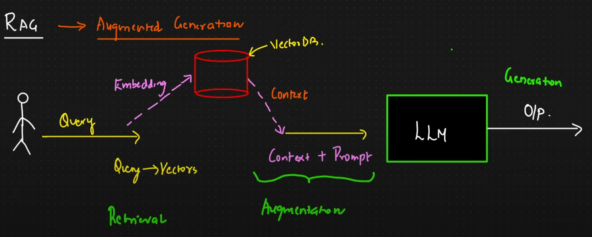
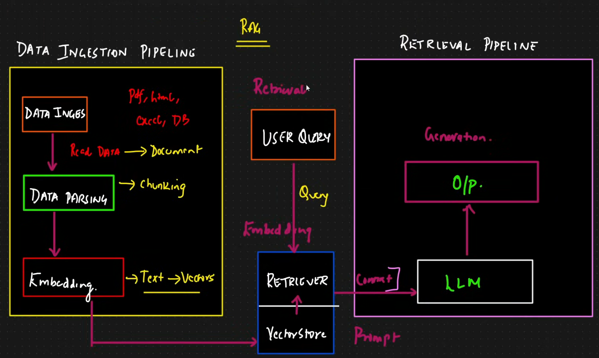
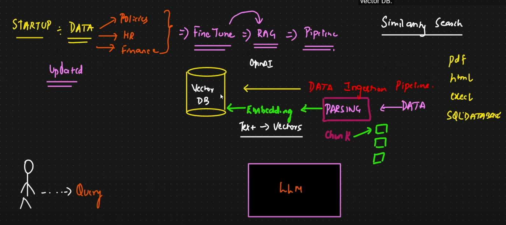

+++
title = 'RAG'
date = 2026-05-19T19:00:35+05:30
draft = false
sharingLinks = ["twitter", "email", "whatsapp"]
+++

## What is RAG, Actually?

- **Retrieval-Augmented Generation (RAG) is the process of optimizing the output of a large language model**, so it references an authoritative knowledge base outside of its training data sources before generating a response. 
- Large Language Models (LLMs) are trained on vast volumes of data and use billions of parameters to generate original output for tasks like answering questions, translating languages, and completing sentences.
- **RAG extends the already powerful capabilities of LLMs to specific domains or an organization's internal knowledqe base**, all without the need to retrain the model. It is a cost-effective approach to improving LLM output so it remains relevant, accurate, and useful in various contexts.

## CONS of only using the LLMs
- llms are trained on a specific set of data, suppose knowledge cut off is month ago, so for current world data **it will hallucinate**.
- also it **cannot access private or internal data**. such as hr policies, finance docs etc
- **fine tuning is a very expensive and tedious** process cuz it involves tweaking billions of parameters.

## Data Ingestion Pipeline

### Similarity search 
- technique used within the RAG pipeline to find info relevant to user query from a db. 
	- to perform - text data is converted to vectors using embedding models
	- the user query is also converted to vector, the system applies algo like cosine similarity to compare query against the vector in the vector db.
	- the search identifies the `chunks of data` most similar to req, this retrieved info is called `context`, which is then sent to LLM to help it generate an accurate answer.

### Semantic search
is an advanced search method that goes beyond keyword matching to understand the **user's intent and the contextual meaning of a query**.

